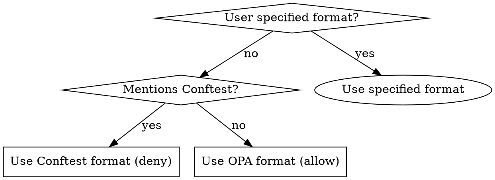

# ComplyPack: Gemara Policy Generation and Assessment

## Overview

Generate Rego policies from Gemara control catalogs that enforce compliance requirements. Policies must be written to disk, validated against the target platform schema, and tested with sample inputs.

**Core principle:** Read control definitions from source → Generate platform-specific policy → Write to disk → Verify it works.

## When to Use

Use when:
- User requests "generate policy for control X"
- User specifies a Gemara catalog and target platform
- User mentions Conftest, OPA, or Rego
- Generating compliance policies from security frameworks

Do NOT use for:
- Writing arbitrary Rego policies (not from Gemara controls)
- Generating policies without a source catalog
- One-off policy snippets that don't need disk storage

## Quick Reference

| Step | Action | Output |
|------|--------|--------|
| 1. Read control | Get definition from catalog (MCP/file/API) | Control text, ID, title |
| 2. Get parameters | Extract assessment requirements with test parameters | Thresholds, values, tools |
| 3. Read schema | Get platform schema (MCP/file) | JSON Schema or CUE |
| 4. Choose format | OPA (allow) or Conftest (deny) | Policy structure |
| 5. Generate policy | Write Rego with control mapping and parameters | .rego file |
| 6. Write to disk | Save to `policy/` or user-specified path | File on disk |
| 7. Verify | Test with sample input | Pass/fail results |

## The Process

### Step 1: Read Control Definition from Source

**DO NOT generate from general knowledge.** Always read the actual control text.

**If ComplyPack MCP server available:**
```
1. List available catalogs: ListMcpResourcesTool(server="complypack")
2. Read specific control: ReadMcpResourceTool(server="complypack", uri="complypack://catalog/{name}")
3. Extract control ID, title, description
```

**If catalog is a file:**
```
1. Read catalog YAML/JSON
2. Find control by ID
3. Extract control text
```

**Critical:** The control definition is your requirements specification. Don't improvise.

### Step 2: Get Assessment Requirements and Parameters

**IMPORTANT:** Assessment requirements contain test parameters, thresholds, and approved tools.

**If ComplyPack MCP server available AND catalog is a Policy:**
```
Use get_assessment_requirements tool:
{
  "catalogName": "policy-name",
  "controlId": "CTL-XXX-001"  // optional filter
}

Returns:
- Structured parameters from Policy.Adherence.AssessmentPlans
- Parameter labels, descriptions, accepted values
- Tool mentions (ToolA, ToolB, etc.)
- File patterns (.gitlab-ci.yml, Jenkinsfile)
```

**What you get:**
- `Parameters` - Structured test values from assessment plans (e.g., {"timeout": "60"})
- `Tools` - Approved tools mentioned (ToolA, ToolB, ToolC)
- `TestValues` - Algorithms, config files, permissions patterns
- `Text` - Full requirement text for context

**Example:**
```json
{
  "id": "CTL-DATA-001-AR3",
  "control_id": "CTL-DATA-001",
  "text": "Certificate validity must not exceed maximum",
  "parameters": {
    "max_validity_days": "90",
    "max_validity_days_description": "Maximum certificate lifetime"
  },
  "tools": [],
  "test_values": []
}
```

**Use these parameters in your policy:**
- Thresholds → Use exact values in comparisons
- Tools → Reference in validation logic
- Accepted values → Use in allow/deny rules

**If catalog is a ControlCatalog (not Policy):**
- Assessment requirements exist but parameters are not attached
- You'll get requirement text and hints (tools, patterns)
- No structured parameter values

### Step 3: Read Platform Schema

Understand what data structure the policy will evaluate.

**If ComplyPack MCP server available:**
```
ReadMcpResourceTool(server="complypack", uri="complypack://schema/{platform}")
```

**Platforms:** kubernetes, terraform, docker, ansible, ci

**Schema tells you:**
- Available fields to validate
- Data types and structure
- What's actually in the input

### Step 4: Choose Policy Format

**Ask user if unclear**, otherwise use this decision tree:



**Conftest format:**
```rego
package main

deny[msg] {
    # Violation condition
    msg := "Violation message"
}
```

**OPA format:**
```rego
package platform.controlid

default allow := false

allow {
    # Compliance conditions
}

violations[msg] {
    # Generate violation messages
}
```

### Step 5: Generate the Policy

Map control requirements to platform-specific checks:

**Template structure:**
```rego
# {Control-ID}: {Control Title}
# {Control Description}

package {namespace}

import rego.v1

# METADATA
# custom:
#   control_id: {ID}
#   control_title: {Title}
#   severity: {high|medium|low}

# [Policy logic based on control requirements and platform schema]
```

**Key requirements:**
- Reference control ID and title in comments
- Use fields that exist in platform schema
- Write clear violation messages
- Include both positive checks (what must exist) and negative checks (what must not)

### Step 6: Write to Disk

**DO NOT just output to chat.** Policies must be saved to files.

**Default structure for Conftest:**
```
policy/
  {control-id}.rego          # e.g., ac-1.rego
  {control-id}_test.rego     # Optional: unit tests
```

**Default structure for OPA:**
```
policies/
  {platform}/
    {control-id}.rego        # e.g., kubernetes/ac-1.rego
```

**Ask user for path if:**
- They have existing policy directory
- Project structure is unclear
- Multiple controls being generated

### Step 7: Verify Policy Works

**Critical step - don't skip this.**

Create sample input matching platform schema:

**For Kubernetes:**
```yaml
apiVersion: apps/v1
kind: Deployment
metadata:
  name: test-app
spec:
  # ... based on schema
```

**For Terraform:**
```json
{
  "address": "aws_s3_bucket.example",
  "type": "aws_s3_bucket",
  "values": {
    # ... based on schema
  }
}
```

**Test the policy:**
```bash
# Conftest
conftest test input.yaml -p policy/

# OPA
opa eval --data policy.rego --input input.json "data.{package}.allow"
```

**Report results:**
- ✅ Policy syntax valid (opa check)
- ✅ Compliant input passes
- ✅ Non-compliant input fails with clear message

## Common Mistakes

| Mistake | Fix |
|---------|-----|
| Generated from general knowledge | Always read actual control definition from source |
| Policy only in chat | Write to disk with proper filename |
| No verification | Test with sample input before claiming done |
| Wrong format (allow vs deny) | Ask user or check for "Conftest" mention |
| Ignoring platform schema | Read schema, use actual fields that exist |
| Missing violation messages | Every deny/violation needs clear message |
| Overly complex structure | Start with single .rego file per control |

## Red Flags - Check These Before Claiming Done

- [ ] Did you read the control definition from the actual source?
- [ ] Did you read the platform schema to know available fields?
- [ ] Did you write the policy to disk (not just chat)?
- [ ] Did you test it with sample input?
- [ ] Does it have clear violation messages?
- [ ] Is the format correct (Conftest deny vs OPA allow)?

## Example Workflow

User: "Generate policy for CTL-DATA-001-AR3 from my-security-policy targeting Kubernetes"

**Steps:**
1. ✅ Read control: `ReadMcpResourceTool(server="complypack", uri="complypack://catalog/my-security-policy")`
2. ✅ Extract CTL-DATA-001 requirements text
3. ✅ Get parameters: `get_assessment_requirements({catalogName: "my-security-policy", controlId: "CTL-DATA-001"})`
4. ✅ Extract parameter: `{"max_validity_days": "90"}` from assessment plan
5. ✅ Read schema: `ReadMcpResourceTool(server="complypack", uri="complypack://schema/kubernetes")`
6. ✅ Note schema fields: spec.tls.secretName, spec.tls.hosts
7. ✅ Generate OPA policy using `max_validity_days` parameter
8. ✅ Write to `policy/ctl-data-001-ar3.rego`
9. ✅ Create test input (Ingress with cert)
10. ✅ Run: `conftest test test-ingress.yaml -p policy/`
11. ✅ Report: "Policy enforces 90-day cert validity. Tested against sample Ingress."

**Example policy using parameters:**
```rego
package kubernetes.ctl_data_001_ar3

import rego.v1

# CTL-DATA-001-AR3: Certificate validity
# Parameters from assessment plan: max_validity_days = 90

deny[msg] {
    cert := input.spec.tls[_]
    cert_days := get_cert_validity_days(cert.secretName)
    
    # Use parameter from assessment plan
    max_days := 90
    cert_days > max_days
    
    msg := sprintf("Certificate %s exceeds maximum validity of %d days", 
                   [cert.secretName, max_days])
}
```

**NOT:**
1. ❌ Generate policy from general knowledge
2. ❌ Hardcode generic value when parameter is specified
3. ❌ Skip get_assessment_requirements step
4. ❌ Output policy in chat only
5. ❌ Skip testing

## Multi-Control Generation

When generating multiple controls:

**Option 1: Separate files (recommended)**
```
policy/
  ac-1.rego
  ac-2.rego
  sc-1.rego
```
Easier to maintain, test, and selectively apply.

**Option 2: Combined file**
```
policy/
  all-controls.rego  # Multiple deny[] or multiple packages
```
Only if user explicitly requests combined.

**Always:**
- Process controls one at a time
- Write each to disk before moving to next
- Test each independently

## Tool Integration

**Works with any tool that can:**
- Read structured data (JSON/YAML)
- Generate Rego code
- Write files to disk

**Not specific to:**
- Claude MCP server (catalog could be files, API, etc.)
- Conftest vs OPA (support both)
- Specific platforms (works for any with schema)

**The workflow is platform-agnostic** - adapt to your environment.
